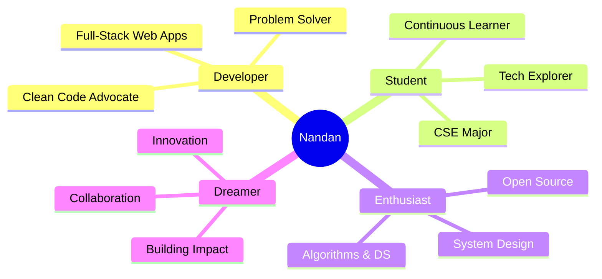

# 👋 Hey there! I'm Nandan Perumalla

<div align="center">

[](https://git.io/typing-svg)


</div>

---

## 🙋‍♂️ Who Am I?

I'm a **passionate Computer Science Engineering student** from India who lives and breathes code! I'm on a mission to solve real-world problems through technology, one line of code at a time.

<div align="center">



</div>

### 🎯 What Defines Me

<table>
<tr>
<td width="50%">

**💡 As a Developer**
- 🔨 I build full-stack applications that solve real problems
- 🧩 I love breaking down complex challenges into elegant solutions
- 📚 I believe in writing clean, maintainable, and scalable code
- 🌱 I'm constantly learning and adapting to new technologies

</td>
<td width="50%">

**🚀 As a Student**
- 📖 Studying Computer Science Engineering
- 🎓 Deep diving into Data Structures & Algorithms
- 💻 Exploring System Design and Architecture
- 🔬 Experimenting with cutting-edge technologies

</td>
</tr>
<tr>
<td width="50%">

**🎨 As a Creator**
- ✨ I transform ideas into working products
- 🎯 User experience is at the heart of what I build
- 🔄 I iterate, improve, and perfect my craft
- 🤝 I believe in collaborative development

</td>
<td width="50%">

**🌟 As a Person**
- ☕ Coffee-powered coding sessions are my jam
- 🎮 When not coding, I'm solving LeetCode problems
- 🌍 Open to remote collaboration opportunities
- 💬 Always happy to discuss tech, ideas, or help others!

</td>
</tr>
</table>

---

## 🛠️ My Technology Stack

<div align="center">

### 🎨 Frontend Craftsman


### ⚙️ Backend Engineer


### 🗄️ Database Specialist


### 🧩 Problem Solving Languages


### 🔧 Tools I Use Daily


</div>

---

## 📈 My Coding Journey

<div align="center">


[](https://git.io/streak-stats)

</div>

---

## 💪 LeetCode Warrior

<div align="center">

[](https://leetcode.com/u/nandan15/)

### 🎯 My Problem-Solving Philosophy

> "Every problem is an opportunity to learn something new. I don't just solve problems—I understand them, break them down, and find the most elegant solution possible."

**Daily Routine:**
- 🌅 Morning: Solve 2-3 LeetCode problems
- 💡 Afternoon: Work on projects & learn new concepts
- 🌙 Evening: Review solutions & explore algorithms

</div>

---

## 🚀 What I'm Up To

<div align="center">

| 🎯 Category | 📌 Current Activities | 🎉 Status |
|:---:|:---|:---:|
| 🏗️ **Building** | Personal Portfolio Website, Full-Stack Projects | 🔥 Active |
| 📚 **Learning** | Advanced System Design, Cloud Technologies | 📖 In Progress |
| 🧠 **Mastering** | Data Structures, Algorithms, Design Patterns | ⚡ Ongoing |
| 🤝 **Contributing** | Open Source Projects, Tech Communities | 🌟 Active |

</div>

### 📖 Currently Exploring

```javascript
const nandan = {
    currentlyLearning: [
        "Advanced System Design Patterns",
        "Microservices Architecture",
        "Cloud Computing (AWS/Azure)",
        "GraphQL & Modern APIs"
    ],
    
    currentProjects: [
        "Building a full-stack e-commerce platform",
        "Contributing to open-source React libraries",
        "Creating algorithm visualization tools"
    ],
    
    goals2025: [
        "Contribute to 10+ open source projects",
        "Build 3 production-ready applications",
        "Master system design principles",
        "Help 100+ developers through mentoring"
    ],
    
    dailyRoutine: () => {
        return "Code → Learn → Build → Repeat ♾️";
    }
};
```

---

## 🏆 Achievements Showcase

<div align="center">

[](https://github.com/ryo-ma/github-profile-trophy)

</div>

---

## 📊 Contribution Heatmap

<div align="center">

[](https://github.com/ashutosh00710/github-readme-activity-graph)

</div>

---

## 🎨 Featured Work

<div align="center">

### 🌟 Projects I'm Proud Of

*Coming soon! Building amazing things—stay tuned!*

</div>

---

## 💬 Let's Connect & Collaborate!

<div align="center">

I'm always excited to connect with fellow developers, work on interesting projects, or just chat about technology!

### 📫 Reach Out To Me

[](https://github.com/Nandanperumalla)
[](https://www.linkedin.com/in/nandan-perumalla-580a78319/)
[](https://leetcode.com/u/nandan15/)
[](mailto:nandanperumalla15@gmail.com)

### 🤝 Open For

```diff
+ 💼 Internship & Job Opportunities
+ 🚀 Exciting Project Collaborations
+ 👥 Open Source Contributions
+ 💡 Tech Discussions & Mentorship
+ 🎯 Hackathons & Coding Challenges
```

</div>

---

## 💭 Random Dev Quote

<div align="center">


</div>

---

## 📊 Profile Insights

<div align="center">


[](https://github.com/Nandanperumalla?tab=followers)
[](https://github.com/Nandanperumalla?tab=repositories)

</div>

---

<div align="center">

### ⚡ Fun Facts About Me

- 🎯 I've solved 100+ coding problems and counting!
- ☕ My code-to-coffee ratio is approximately 100:1
- 🌙 I'm most productive during late-night coding sessions
- 🎮 I treat debugging like a puzzle game—and I love winning!
- 🚀 My dream: Build products that impact millions of lives

---


[](https://git.io/typing-svg)

**"Code is like humor. When you have to explain it, it's bad." – Cory House**

</div>
